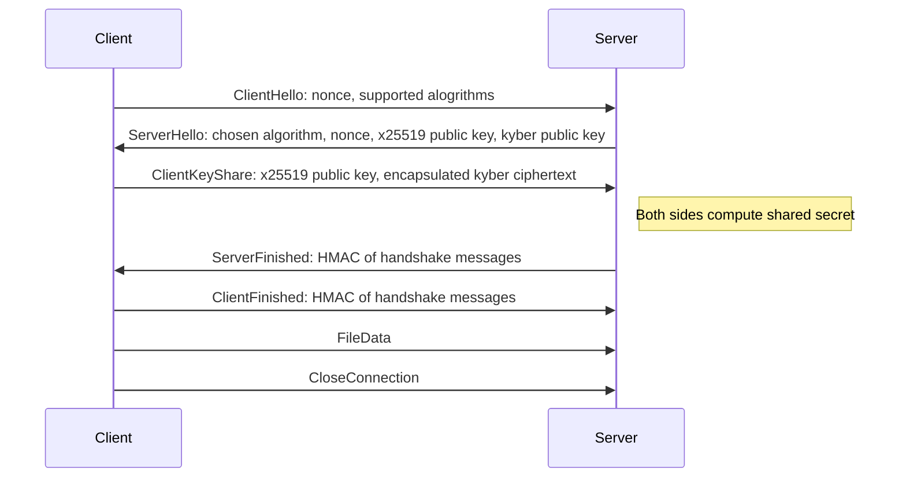
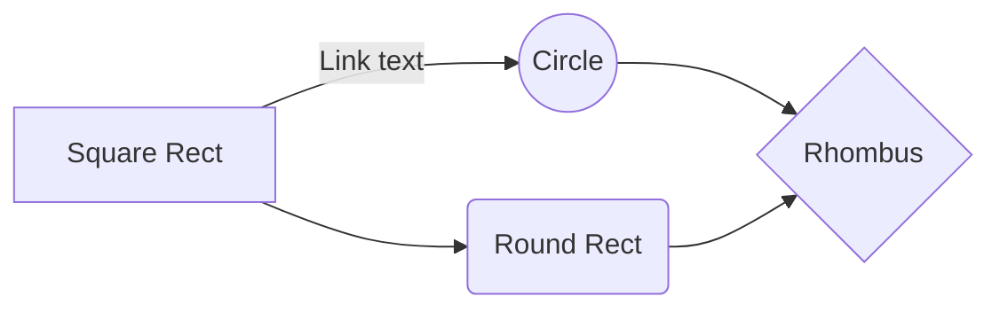

# qpost

Post quantum cryptography file transfer command line tool.

# Architecture

One way file transfer protocol. Receiver runs the server source code and sender runs the client source code.

Uses CRYSTALS-Kyber key encapsulation, which has been selected by NIST as one of the standard algorithms for post quantum public-key encryption.

# Handshake

# Instructions for use

Clone the repository:
`git clone https://github.com/biokemisti/qpost`

Initialize CMake:
`cmake`

Build the project with:
`make`

# Dependencies
In order to successfully build the tool, the following dependencies need to be installed:

| Library          | Tested version                  |
| ---------------- | ------------------------------- |
| libsodium        | 1.0.21                          |
| liboqs           | 0.12.0                          |

And this will produce a flow chart:

