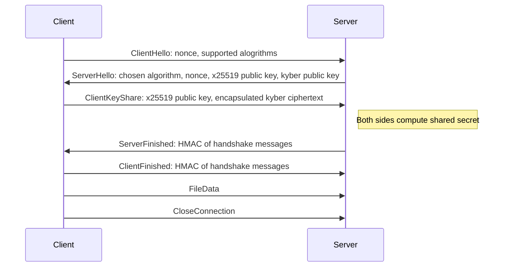
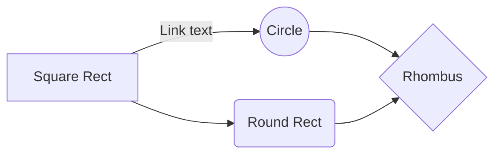

# qpost

Post quantum cryptography file transfer command line tool.

# Architecture

One way file transfer protocol. Receiver runs the server source code and sender runs the client source code.

Uses CRYSTALS-Kyber key encapsulation, which has been selected by NIST as one of the standard algorithms for post quantum public-key encryption.

# Handshake

## SmartyPants

SmartyPants converts ASCII punctuation characters into "smart" typographic punctuation HTML entities. For example:

|                  | ASCII                           | HTML                          |
| ---------------- | ------------------------------- | ----------------------------- |
| Single backticks | `'Isn't this fun?'`             | 'Isn't this fun?'             |
| Quotes           | `"Isn't this fun?"`             | "Isn't this fun?"             |
| Dashes           | `-- is en-dash, --- is em-dash` | -- is en-dash, --- is em-dash |

And this will produce a flow chart:

