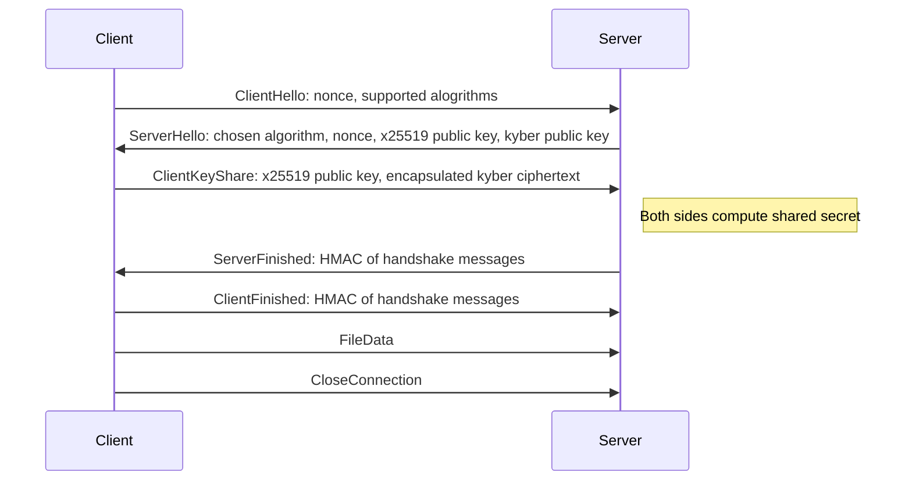

# qpost

Post quantum cryptography file transfer command line tool.


# Description

A command line tool used for one way file transfer, equipped with a post quantum safe key exchange algorithm to prevent ["Harverst now, decrypt later"](https://en.wikipedia.org/wiki/Harvest_now,_decrypt_later) attacks.

Uses CRYSTALS-Kyber key encapsulation, which has been selected by NIST as one of the standard algorithms for post quantum public-key encryption.

The tool works by establishing a one way TCP connection between the two parties. A hybrid key exchange protocol that uses X25519 elliptic curve cryptography combined with the CRYSTALS-Kyber key encapsulation (a standard alogrithm selected by NIST for post quantum cryptography) is used to ensure confidentiality. Files can then be encrypted and sent over the TCP connection from the client/sender to the server/receiver.


# Handshake




# Instructions for use

## 1. Clone the repository

```bash
git clone https://github.com/biokemisti/qpost
cd qpost
```

## 2. Install dependencies
| Library          | Tested version                  |
| ---------------- | ------------------------------- |
| libsodium        | 1.0.21                          |
| liboqs           | 0.12.0                          |
| CMake            | 3.31.10                         |
| C++17 Compiler   | g++ (GCC) 15.2.1                |

## 3. Build
```bash
mkdir build
cd build
cmake ..
make
```

## 4. Run
#### Start receiver / server:
```bash
./server
```

#### Start sender / client:
```bash
./client
```
