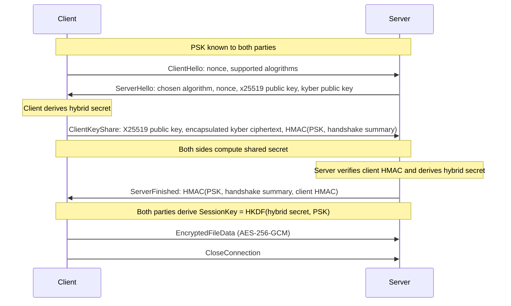

# qpost

Post quantum cryptography file transfer command line tool.

# Description

A command line tool used for one way file transfer, equipped with a post quantum safe key exchange algorithm to prevent ["Harverst now, decrypt later"](https://en.wikipedia.org/wiki/Harvest_now,_decrypt_later) attacks.

Uses CRYSTALS-Kyber key encapsulation, which has been selected by NIST as one of the standard algorithms for post quantum public-key encryption.

The tool works by establishing a one way TCP connection between the two parties. A hybrid key exchange protocol that uses X25519 elliptic curve cryptography combined with the CRYSTALS-Kyber key encapsulation (a standard alogrithm selected by NIST for post quantum cryptography) is used to ensure confidentiality. Files can then be encrypted and sent over the TCP connection from the client/sender to the server/receiver.

# Authentication

Authentication between the user and the server is based on 256-bit symmetric pre-shared keys. The server and the client must keep a whitelist of allowed connections.

# Handshake

Each session is encrypted with a new symmetric key to ensure forward-secrecy. Even if the pre-shared keys were to leak, all the previous sessions are protected from harvest now decrypt later -attacks, since each session is equipped with fresh encryption keys.



# Encryption

Symmetric AES-256-GCM keys are generated and used for encrypting all file transfers between the user and the server. The Galois/Counter Mode of operation esures that the files were not tampered with in transmission.

# Instructions for use

## 1. Clone the repository

```bash
git clone https://github.com/biokemisti/qpost
cd qpost
```

## 2. Install dependencies

| Library        | Tested version   |
| -------------- | ---------------- |
| libsodium      | 1.0.21           |
| liboqs         | 0.12.0           |
| CMake          | 3.31.10          |
| C++17 Compiler | g++ (GCC) 15.2.1 |

## 3. Build

```bash
mkdir build
cd build
cmake ..
make
```

## 4. Run

#### Start receiver / server:

```bash
./server
```

#### Start sender / client:

```bash
./client
```

- Encryption: AES256 post quantum secure according to NIST
- POCO libraries for transferring data, wraps C++ iostreams with network sockets
- break file binaries into chunks, Encrypt with AES256, send header with incremented nonce and chunk size, send chunk, send end of transmission
- implement simple CLI
